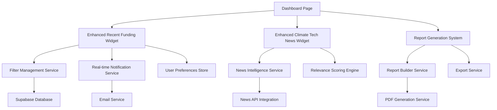

# Design Document

## Overview

This design document outlines the enhancement of the existing MooMoo Climate dashboard widgets to create an MVP focused on Alex Chen's persona as a climate tech analyst. The design transforms the current generic dashboard into a specialized tool with three core enhanced widgets: an expanded Recent Funding Rounds widget with real-time filtering, an intelligent Climate Tech News widget with relevance scoring, and a new Report Generation system.

The design leverages the existing Next.js 14 architecture with React components, TypeScript, and Supabase backend, while introducing new filtering capabilities, notification systems, and export functionality.

## Architecture

### High-Level Architecture



### Component Architecture

The enhanced dashboard will maintain the existing component structure while adding new specialized components, with strict adherence to code quality standards:

- **Enhanced Widget Components**: Expanded versions of existing widgets with new functionality (max 300-400 lines each)
- **Filter Management**: New filtering UI components and state management (separate components for each filter type)
- **Notification System**: Enhanced real-time notification components (modular notification types)
- **Report Generation**: New report builder and export components (separate components for each export format)
- **User Preferences**: New preference management system (separate components for each preference category)

**Refactoring Requirements**: The existing dashboard page (1112+ lines) must be refactored into smaller components before implementing enhancements.

## Components and Interfaces

### 1. Enhanced Recent Funding Rounds Widget

#### Component Structure
```typescript
interface EnhancedFundingRoundsProps {
  size: 'normal' | 'expanded'; // New size prop for 2x expansion
  filters: FundingFilters;
  onFilterChange: (filters: FundingFilters) => void;
  realTimeEnabled: boolean;
}

interface FundingFilters {
  stages: FundingStage[];
  sectors: string[];
  fundingRange: {
    min: number;
    max: number;
  };
  dateRange: {
    start: Date;
    end: Date;
  };
  keywords: string[];
}

interface FundingStage {
  id: string;
  name: 'Seed' | 'Series A' | 'Series B' | 'Series C+';
  selected: boolean;
}
```

#### Key Features
- **Expanded Size**: Widget takes up 2x the current grid space (2 columns instead of 1)
- **Advanced Filtering Panel**: Collapsible filter panel with stage, sector, amount, and keyword filters
- **Real-time Highlighting**: New deals matching filters are highlighted with animation
- **Saved Filter Presets**: Users can save and quickly apply filter combinations
- **Quick Actions**: Direct actions on deals (save, export, add to report)

### 2. Enhanced Climate Tech News Widget

#### Component Structure
```typescript
interface EnhancedNewsProps {
  filters: NewsFilters;
  relevanceThreshold: number;
  onArticleClick: (article: NewsArticle) => void;
}

interface NewsArticle {
  id: string;
  title: string;
  description: string;
  source: string;
  publishedAt: Date;
  relevanceScore: number;
  signals: NewsSignal[];
  relatedCompanies: string[];
  category: NewsCategory;
}

interface NewsSignal {
  type: 'funding' | 'product_launch' | 'patent' | 'partnership' | 'acquisition';
  confidence: number;
  extractedData: Record<string, any>;
}

enum NewsCategory {
  FUNDING = 'funding',
  PRODUCT = 'product',
  MARKET = 'market',
  REGULATORY = 'regulatory',
  PARTNERSHIP = 'partnership'
}
```

#### Key Features
- **Signal Detection**: Automatically identifies and tags funding, product launch, and patent signals
- **Relevance Scoring**: AI-powered relevance scoring based on user's sector preferences
- **Visual Signal Indicators**: Color-coded badges for different signal types
- **Company Linking**: Links news to companies in the funding database
- **Smart Filtering**: Filters based on user's funding round preferences

### 3. Report Generation System

#### Component Structure
```typescript
interface ReportGeneratorProps {
  dashboardData: DashboardData;
  selectedFilters: FilterState;
  onGenerateReport: (config: ReportConfig) => void;
}

interface ReportConfig {
  title: string;
  sections: ReportSection[];
  format: 'pdf' | 'excel' | 'powerpoint';
  template: ReportTemplate;
  includeCharts: boolean;
  includeTables: boolean;
  customBranding: boolean;
}

interface ReportSection {
  type: 'funding_rounds' | 'news_highlights' | 'market_signals' | 'executive_summary';
  title: string;
  data: any;
  chartType?: 'bar' | 'line' | 'pie' | 'table';
}
```

#### Key Features
- **One-Click Generation**: Generate reports directly from current dashboard view
- **Multiple Formats**: PDF, Excel, and PowerPoint export options
- **Template System**: Pre-built templates for different report types
- **Dynamic Content**: Reports automatically include filtered data and current metrics
- **Professional Formatting**: Presentation-ready layouts with charts and tables

## Data Models

### Enhanced Funding Deal Model
```typescript
interface EnhancedFundingDeal extends FundingDeal {
  signals: DealSignal[];
  relevanceScore: number;
  matchedFilters: string[];
  isNew: boolean;
  highlightUntil?: Date;
}

interface DealSignal {
  type: 'growth_indicator' | 'market_expansion' | 'technology_advancement';
  description: string;
  confidence: number;
  source: string;
}
```

### User Preferences Model
```typescript
interface UserPreferences {
  id: string;
  userId: string;
  defaultFilters: {
    funding: FundingFilters;
    news: NewsFilters;
  };
  notificationSettings: {
    email: boolean;
    push: boolean;
    frequency: 'immediate' | 'daily' | 'weekly';
  };
  dashboardLayout: {
    widgetSizes: Record<string, 'normal' | 'expanded'>;
    widgetOrder: string[];
  };
  reportTemplates: ReportTemplate[];
}
```

## Error Handling

### Enhanced Error Boundaries
- **Widget-Level Error Boundaries**: Each enhanced widget has its own error boundary with retry functionality
- **Graceful Degradation**: If advanced features fail, widgets fall back to basic functionality
- **User-Friendly Messages**: Clear error messages with actionable next steps
- **Automatic Retry Logic**: Failed API calls are automatically retried with exponential backoff

### Error Recovery Strategies
- **Filter Persistence**: User filters are saved locally and restored after errors
- **Partial Loading**: Widgets can display partial data while other sections load
- **Offline Mode**: Basic functionality available when real-time features are unavailable

## Testing Strategy

### Unit Testing
- **Component Testing**: Test each enhanced widget component in isolation
- **Filter Logic Testing**: Comprehensive tests for filtering and search functionality
- **Report Generation Testing**: Test report generation with various data scenarios
- **Preference Management Testing**: Test saving and loading user preferences

### Integration Testing
- **Real-time Updates**: Test real-time notification system with mock data
- **API Integration**: Test integration with enhanced backend APIs
- **Cross-Widget Communication**: Test how widgets interact and share state
- **Export Functionality**: Test report generation and export in different formats

### End-to-End Testing
- **User Workflow Testing**: Test complete user journeys from filtering to report generation
- **Performance Testing**: Test widget performance with large datasets
- **Notification Testing**: Test email and push notification delivery
- **Cross-Browser Testing**: Ensure compatibility across different browsers

## Implementation Phases

### Phase 1: Enhanced Recent Funding Rounds Widget
- Expand widget size to 2x current dimensions
- Implement advanced filtering UI
- Add real-time highlighting for new deals
- Implement filter persistence

### Phase 2: Enhanced Climate Tech News Widget
- Implement news signal detection
- Add relevance scoring system
- Create visual signal indicators
- Implement smart filtering based on funding preferences

### Phase 3: Report Generation System
- Create report builder UI
- Implement PDF generation service
- Add Excel and PowerPoint export options
- Create report template system

### Phase 4: Integration and Polish
- Integrate all enhanced widgets
- Implement user preference management
- Add comprehensive error handling
- Performance optimization and testing

## Technical Considerations

### Code Quality Standards
- **Component Size Limit**: All React components must not exceed 300-400 lines of code
- **Single Responsibility**: Each component should have one clear, focused purpose
- **Modular Architecture**: Large features must be broken into smaller, reusable modules
- **Refactoring Requirements**: Any existing components over 400 lines must be refactored before enhancement
- **Regular Code Reviews**: Code quality checks are mandatory at each implementation phase

### Performance Optimization
- **Lazy Loading**: Load widget data progressively to improve initial page load
- **Caching Strategy**: Cache filtered results and user preferences
- **Debounced Filtering**: Prevent excessive API calls during filter changes
- **Virtual Scrolling**: Handle large datasets efficiently in expanded widgets

### Scalability
- **Modular Architecture**: Each enhancement is a separate module that can be developed independently
- **API Design**: RESTful APIs with pagination and filtering support
- **Database Optimization**: Indexed queries for fast filtering and searching
- **CDN Integration**: Static assets served via CDN for better performance

### Security
- **Input Validation**: All user inputs are validated and sanitized
- **API Authentication**: Secure API endpoints with proper authentication
- **Data Privacy**: User preferences and filters are encrypted at rest
- **Export Security**: Generated reports include watermarks and access controls