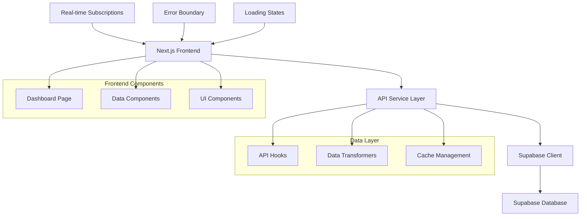

# Design Document

## Overview

This design outlines the integration of the existing Next.js frontend with the Supabase backend to replace mock data with real climate tech funding data. The solution will implement a layered architecture with API services, data management, error handling, and real-time updates while maintaining the current UI/UX design.

## Architecture

### High-Level Architecture



### Data Flow

1. **Initial Load**: Dashboard components trigger data fetching through custom hooks
2. **API Layer**: Service functions handle Supabase queries and data transformation
3. **State Management**: React hooks manage loading states, errors, and data caching
4. **Real-time Updates**: Supabase subscriptions push updates to components
5. **Error Handling**: Error boundaries catch and handle failures gracefully

## Components and Interfaces

### API Service Layer

**Location**: `src/lib/api/`

```typescript
// src/lib/api/types.ts
export interface FundingDeal {
  id: number;
  company_name: string;
  funding_stage: string;
  amount_raised: number;
  date_announced: string;
  lead_investors: string;
  other_investors: string;
  climate_sub_sector: string;
  geography_country: string;
  status: string;
  created_at: string;
}

export interface DashboardMetrics {
  total_deals: number;
  total_funding: number;
  total_companies: number;
  total_investors: number;
  growth_rate: number;
}

export interface ApiResponse<T> {
  data: T | null;
  error: string | null;
  loading: boolean;
}
```

**Supabase Client Configuration**:
```typescript
// src/lib/supabase/client.ts
import { createClient } from '@supabase/supabase-js';

const supabaseUrl = process.env.NEXT_PUBLIC_SUPABASE_URL!;
const supabaseKey = process.env.NEXT_PUBLIC_SUPABASE_ANON_KEY!;

export const supabase = createClient(supabaseUrl, supabaseKey);
```

**API Service Functions**:
```typescript
// src/lib/api/funding.ts
export class FundingService {
  static async getDashboardMetrics(): Promise<ApiResponse<DashboardMetrics>>
  static async getRecentDeals(limit?: number): Promise<ApiResponse<FundingDeal[]>>
  static async getDealsWithFilters(filters: DealFilters): Promise<ApiResponse<FundingDeal[]>>
  static async subscribeToDeals(callback: (deals: FundingDeal[]) => void): Promise<void>
}
```

### Custom Hooks

**Location**: `src/hooks/`

```typescript
// src/hooks/useDashboardData.ts
export function useDashboardData() {
  const [metrics, setMetrics] = useState<DashboardMetrics | null>(null);
  const [recentDeals, setRecentDeals] = useState<FundingDeal[]>([]);
  const [loading, setLoading] = useState(true);
  const [error, setError] = useState<string | null>(null);
  
  // Implementation with data fetching, error handling, and real-time updates
}

// src/hooks/useRealTimeDeals.ts
export function useRealTimeDeals() {
  // Real-time subscription management
}
```

### Data Transformation Layer

**Location**: `src/lib/transformers/`

```typescript
// src/lib/transformers/dashboard.ts
export class DashboardTransformer {
  static transformDealsForDisplay(deals: FundingDeal[]): DisplayDeal[]
  static calculateMetrics(deals: FundingDeal[]): DashboardMetrics
  static formatCurrency(amount: number): string
  static formatDate(date: string): string
}
```

### Updated Dashboard Components

**Enhanced Dashboard Page**:
- Replace mock data with API calls
- Add loading states and error handling
- Implement real-time updates
- Maintain existing UI design

**Component Structure**:
```typescript
// src/app/dashboard/page.tsx (updated)
export default function Dashboard() {
  const { metrics, recentDeals, loading, error, refetch } = useDashboardData();
  const { isConnected } = useRealTimeDeals();
  
  if (loading) return <DashboardSkeleton />;
  if (error) return <ErrorBoundary error={error} onRetry={refetch} />;
  
  // Render dashboard with real data
}
```

## Data Models

### Database Schema (Supabase)

```sql
-- Existing deals table structure
CREATE TABLE public.deals (
  id bigint GENERATED ALWAYS AS IDENTITY NOT NULL,
  created_at timestamp with time zone NOT NULL DEFAULT now(),
  company_name text DEFAULT ''::text,
  amount_raised double precision,
  currency double precision,
  funding_stage text,
  date_announced date,
  lead_investors text,
  other_investors text,
  climate_sub_sector text,
  geography_country text,
  source_url text,
  raw_text_content text,
  status text DEFAULT 'NEW'::text,
  funding_amount_str text,
  CONSTRAINT deals_pkey PRIMARY KEY (id)
);

-- Recommended indexes for performance
CREATE INDEX IF NOT EXISTS idx_deals_date_announced ON deals(date_announced DESC);
CREATE INDEX IF NOT EXISTS idx_deals_funding_stage ON deals(funding_stage);
CREATE INDEX IF NOT EXISTS idx_deals_status ON deals(status);
```

### TypeScript Interfaces

```typescript
// src/types/api.ts
export interface DatabaseDeal {
  id: number;
  created_at: string;
  company_name: string;
  amount_raised: number;
  currency: number;
  funding_stage: string;
  date_announced: string;
  lead_investors: string;
  other_investors: string;
  climate_sub_sector: string;
  geography_country: string;
  source_url: string;
  raw_text_content: string;
  status: string;
  funding_amount_str: string;
}

// src/types/dashboard.ts (updated)
export interface Deal extends DatabaseDeal {
  // Additional computed properties
  formattedAmount: string;
  formattedDate: string;
  daysAgo: number;
  allInvestors: string[]; // Combined lead and other investors
}
```

## Error Handling

### Error Boundary Component

```typescript
// src/components/ErrorBoundary.tsx
export function ErrorBoundary({ 
  error, 
  onRetry, 
  fallback 
}: ErrorBoundaryProps) {
  // Graceful error display with retry functionality
}
```

### Error Types and Handling

```typescript
// src/lib/errors/types.ts
export enum ErrorType {
  NETWORK_ERROR = 'NETWORK_ERROR',
  DATABASE_ERROR = 'DATABASE_ERROR',
  VALIDATION_ERROR = 'VALIDATION_ERROR',
  TIMEOUT_ERROR = 'TIMEOUT_ERROR'
}

export class ApiError extends Error {
  constructor(
    public type: ErrorType,
    message: string,
    public retryable: boolean = true
  ) {
    super(message);
  }
}
```

### Retry Logic

```typescript
// src/lib/utils/retry.ts
export async function withRetry<T>(
  fn: () => Promise<T>,
  maxAttempts: number = 3,
  backoffMs: number = 1000
): Promise<T> {
  // Exponential backoff retry implementation
}
```

## Testing Strategy

### Unit Tests

**API Services Testing**:
```typescript
// src/lib/api/__tests__/funding.test.ts
describe('FundingService', () => {
  test('should fetch dashboard metrics successfully');
  test('should handle network errors gracefully');
  test('should transform data correctly');
});
```

**Custom Hooks Testing**:
```typescript
// src/hooks/__tests__/useDashboardData.test.ts
describe('useDashboardData', () => {
  test('should load data on mount');
  test('should handle loading states');
  test('should handle errors');
  test('should refetch data on retry');
});
```

### Integration Tests

**Dashboard Integration**:
```typescript
// src/app/dashboard/__tests__/page.test.tsx
describe('Dashboard Page', () => {
  test('should display real data from API');
  test('should show loading state during fetch');
  test('should handle API errors gracefully');
  test('should update with real-time data');
});
```

### End-to-End Tests

**User Journey Testing**:
- Dashboard loads with real data
- Error states display correctly
- Real-time updates work
- Performance meets requirements

## Performance Optimizations

### Data Fetching

1. **Parallel Requests**: Fetch metrics and deals simultaneously
2. **Caching**: Implement client-side caching with SWR or React Query
3. **Pagination**: Load deals in batches for large datasets
4. **Debouncing**: Debounce search and filter operations

### Real-time Updates

1. **Selective Subscriptions**: Only subscribe to relevant data changes
2. **Batched Updates**: Group multiple updates to prevent UI thrashing
3. **Connection Management**: Handle connection drops and reconnections

### Code Splitting

```typescript
// Lazy load heavy components
const DashboardCharts = lazy(() => import('./components/DashboardCharts'));
const AdvancedFilters = lazy(() => import('./components/AdvancedFilters'));
```

## Security Considerations

### Environment Variables

```env
# .env.local
NEXT_PUBLIC_SUPABASE_URL=your_supabase_url
NEXT_PUBLIC_SUPABASE_ANON_KEY=your_supabase_anon_key
```

### Row Level Security (RLS)

```sql
-- Enable RLS on funding_deals table
ALTER TABLE funding_deals ENABLE ROW LEVEL SECURITY;

-- Policy for read access
CREATE POLICY "Allow read access to funding_deals" 
ON funding_deals FOR SELECT 
USING (status = 'verified');
```

### Data Validation

```typescript
// src/lib/validation/schemas.ts
export const dealSchema = z.object({
  company_name: z.string().min(1).max(255),
  funding_stage: z.enum(['Seed', 'Series A', 'Series B', 'Series C+']),
  amount_raised: z.number().positive(),
  funding_date: z.string().datetime(),
});
```

## Deployment Considerations

### Environment Setup

1. **Development**: Local Supabase instance or development database
2. **Staging**: Staging Supabase project with test data
3. **Production**: Production Supabase project with live data

### Performance Monitoring

1. **API Response Times**: Monitor query performance
2. **Error Rates**: Track API failures and error types
3. **Real-time Connection Health**: Monitor WebSocket connections
4. **User Experience Metrics**: Track loading times and user interactions

### Rollback Strategy

1. **Feature Flags**: Toggle between mock and real data
2. **Gradual Rollout**: Deploy to percentage of users first
3. **Monitoring**: Watch for performance degradation
4. **Quick Rollback**: Ability to revert to mock data if needed