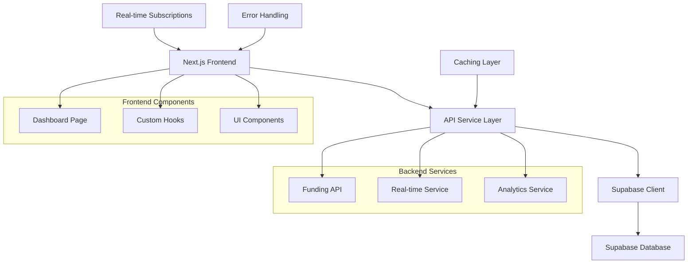
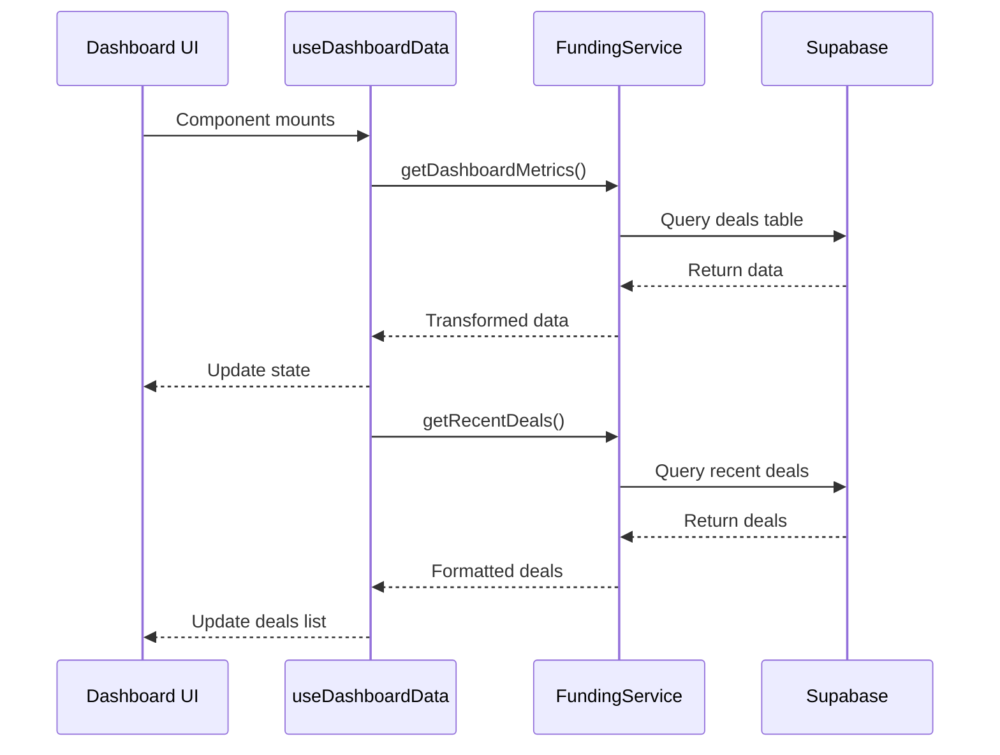
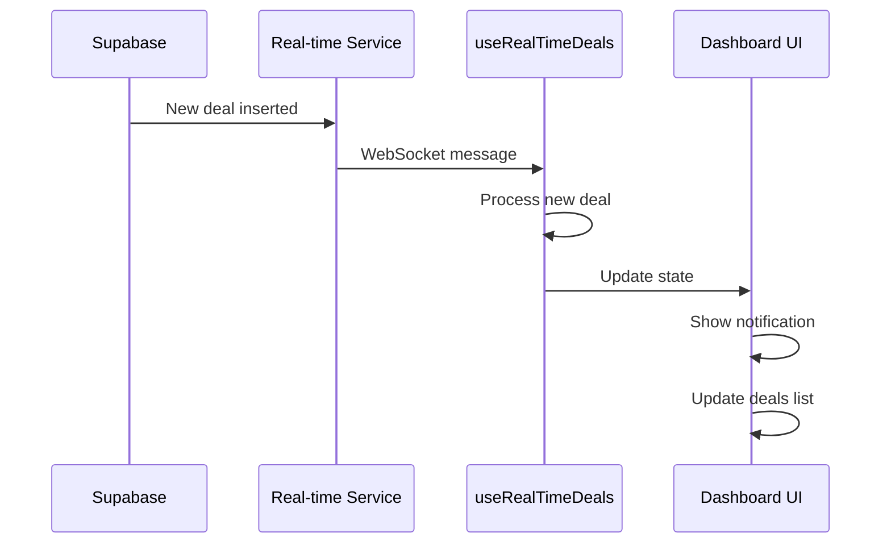
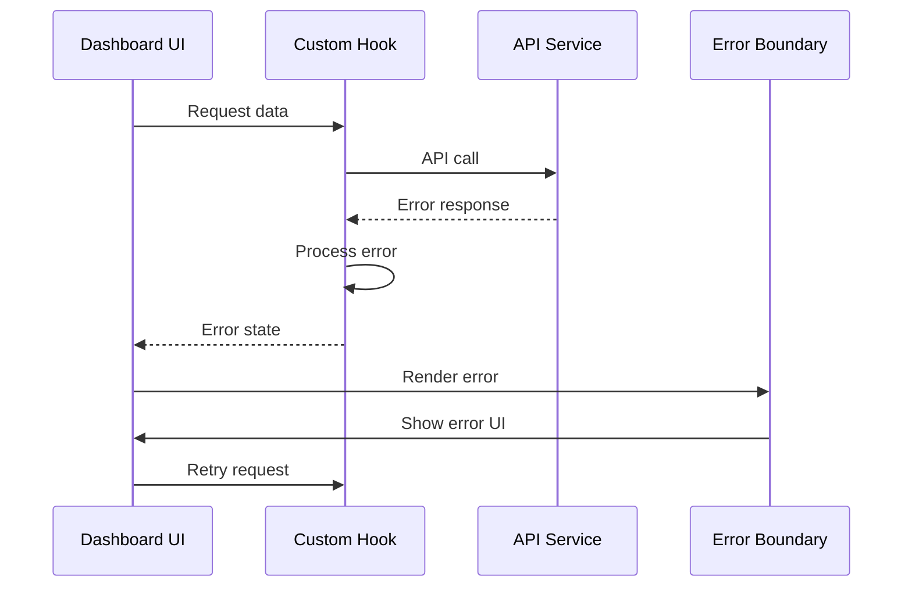

# API Integration Documentation

## Overview

This document provides comprehensive information about the API integration between the Next.js frontend and Supabase backend for the Climate Tech Funding Dashboard.

## Architecture Overview



## API Endpoints

### Supabase REST API

Base URL: `{SUPABASE_URL}/rest/v1/`

#### Deals Endpoint

**GET /deals**
- **Purpose**: Retrieve funding deals data
- **Authentication**: Requires `apikey` header
- **Parameters**:
  - `select`: Specify columns to return
  - `limit`: Number of records to return
  - `offset`: Number of records to skip
  - `order`: Sort order (e.g., `date_announced.desc`)
  - `filter`: Apply filters (e.g., `status=eq.verified`)

**Example Request**:
```bash
curl -X GET \
  "${SUPABASE_URL}/rest/v1/deals?select=*&limit=10&order=date_announced.desc" \
  -H "apikey: ${SUPABASE_ANON_KEY}" \
  -H "Authorization: Bearer ${SUPABASE_ANON_KEY}"
```

**Example Response**:
```json
[
  {
    "id": 1,
    "company_name": "CleanTech Solutions",
    "funding_stage": "Series A",
    "amount_raised": 15000000,
    "date_announced": "2024-01-15",
    "lead_investors": "Green Ventures",
    "climate_sub_sector": "Energy Storage",
    "geography_country": "United States",
    "status": "verified"
  }
]
```

#### Aggregation Queries

**Dashboard Metrics**:
```sql
-- Total deals count
SELECT COUNT(*) as total_deals FROM deals WHERE status = 'verified';

-- Total funding amount
SELECT SUM(amount_raised) as total_funding FROM deals WHERE status = 'verified';

-- Unique companies count
SELECT COUNT(DISTINCT company_name) as total_companies FROM deals WHERE status = 'verified';

-- Recent deals (last 30 days)
SELECT * FROM deals 
WHERE status = 'verified' 
AND date_announced >= CURRENT_DATE - INTERVAL '30 days'
ORDER BY date_announced DESC;
```

### Real-time Subscriptions

**WebSocket Endpoint**: `{SUPABASE_URL}/realtime/v1/websocket`

**Subscription Configuration**:
```javascript
const subscription = supabase
  .channel('deals-changes')
  .on('postgres_changes', {
    event: 'INSERT',
    schema: 'public',
    table: 'deals'
  }, (payload) => {
    console.log('New deal added:', payload.new);
  })
  .subscribe();
```

## Data Flow

### 1. Initial Data Loading



### 2. Real-time Updates



### 3. Error Handling Flow



## Service Layer Implementation

### FundingService Class

**Location**: `src/lib/api/funding.ts`

```typescript
export class FundingService {
  private static supabase = createClient(
    process.env.NEXT_PUBLIC_SUPABASE_URL!,
    process.env.NEXT_PUBLIC_SUPABASE_ANON_KEY!
  );

  /**
   * Fetch dashboard metrics including total deals, funding, companies
   */
  static async getDashboardMetrics(): Promise<ApiResponse<DashboardMetrics>> {
    try {
      const { data, error } = await this.supabase
        .from('deals')
        .select('amount_raised, company_name')
        .eq('status', 'verified');

      if (error) throw error;

      const metrics = this.calculateMetrics(data);
      return { data: metrics, error: null, loading: false };
    } catch (error) {
      return { 
        data: null, 
        error: error.message, 
        loading: false 
      };
    }
  }

  /**
   * Fetch recent deals with optional limit
   */
  static async getRecentDeals(limit = 5): Promise<ApiResponse<FundingDeal[]>> {
    try {
      const { data, error } = await this.supabase
        .from('deals')
        .select('*')
        .eq('status', 'verified')
        .order('date_announced', { ascending: false })
        .limit(limit);

      if (error) throw error;

      const transformedDeals = data.map(this.transformDeal);
      return { data: transformedDeals, error: null, loading: false };
    } catch (error) {
      return { 
        data: null, 
        error: error.message, 
        loading: false 
      };
    }
  }

  /**
   * Subscribe to real-time deal updates
   */
  static subscribeToDeals(callback: (deals: FundingDeal[]) => void) {
    return this.supabase
      .channel('deals-changes')
      .on('postgres_changes', {
        event: 'INSERT',
        schema: 'public',
        table: 'deals'
      }, (payload) => {
        const newDeal = this.transformDeal(payload.new);
        callback([newDeal]);
      })
      .subscribe();
  }

  private static transformDeal(deal: any): FundingDeal {
    return {
      ...deal,
      formattedAmount: this.formatCurrency(deal.amount_raised),
      formattedDate: this.formatDate(deal.date_announced),
      daysAgo: this.calculateDaysAgo(deal.date_announced)
    };
  }

  private static calculateMetrics(deals: any[]): DashboardMetrics {
    return {
      total_deals: deals.length,
      total_funding: deals.reduce((sum, deal) => sum + (deal.amount_raised || 0), 0),
      total_companies: new Set(deals.map(d => d.company_name)).size,
      total_investors: 0, // Calculate based on your needs
      growth_rate: 0 // Calculate based on historical data
    };
  }
}
```

### Custom Hooks Implementation

**useDashboardData Hook**:

```typescript
export function useDashboardData() {
  const [state, setState] = useState<DashboardState>({
    metrics: null,
    recentDeals: [],
    loading: true,
    error: null
  });

  const fetchData = useCallback(async () => {
    setState(prev => ({ ...prev, loading: true, error: null }));

    try {
      const [metricsResponse, dealsResponse] = await Promise.all([
        FundingService.getDashboardMetrics(),
        FundingService.getRecentDeals()
      ]);

      if (metricsResponse.error || dealsResponse.error) {
        throw new Error(metricsResponse.error || dealsResponse.error);
      }

      setState({
        metrics: metricsResponse.data,
        recentDeals: dealsResponse.data || [],
        loading: false,
        error: null
      });
    } catch (error) {
      setState(prev => ({
        ...prev,
        loading: false,
        error: error.message
      }));
    }
  }, []);

  useEffect(() => {
    fetchData();
  }, [fetchData]);

  return {
    ...state,
    refetch: fetchData
  };
}
```

## Error Handling Strategy

### Error Types

```typescript
export enum ApiErrorType {
  NETWORK_ERROR = 'NETWORK_ERROR',
  DATABASE_ERROR = 'DATABASE_ERROR',
  AUTHENTICATION_ERROR = 'AUTHENTICATION_ERROR',
  VALIDATION_ERROR = 'VALIDATION_ERROR',
  TIMEOUT_ERROR = 'TIMEOUT_ERROR'
}

export class ApiError extends Error {
  constructor(
    public type: ApiErrorType,
    message: string,
    public retryable: boolean = true,
    public statusCode?: number
  ) {
    super(message);
    this.name = 'ApiError';
  }
}
```

### Retry Logic

```typescript
export async function withRetry<T>(
  fn: () => Promise<T>,
  options: RetryOptions = {}
): Promise<T> {
  const {
    maxAttempts = 3,
    baseDelay = 1000,
    maxDelay = 10000,
    backoffFactor = 2
  } = options;

  let lastError: Error;

  for (let attempt = 1; attempt <= maxAttempts; attempt++) {
    try {
      return await fn();
    } catch (error) {
      lastError = error;

      if (attempt === maxAttempts || !isRetryableError(error)) {
        throw error;
      }

      const delay = Math.min(
        baseDelay * Math.pow(backoffFactor, attempt - 1),
        maxDelay
      );

      await new Promise(resolve => setTimeout(resolve, delay));
    }
  }

  throw lastError;
}
```

## Performance Optimizations

### Caching Strategy

1. **React Query Integration**:
```typescript
export function useDashboardDataCached() {
  return useQuery({
    queryKey: ['dashboard-data'],
    queryFn: async () => {
      const [metrics, deals] = await Promise.all([
        FundingService.getDashboardMetrics(),
        FundingService.getRecentDeals()
      ]);
      return { metrics: metrics.data, deals: deals.data };
    },
    staleTime: 5 * 60 * 1000, // 5 minutes
    cacheTime: 10 * 60 * 1000, // 10 minutes
    refetchOnWindowFocus: false
  });
}
```

2. **Database Query Optimization**:
```sql
-- Recommended indexes
CREATE INDEX CONCURRENTLY idx_deals_status_date 
ON deals(status, date_announced DESC);

CREATE INDEX CONCURRENTLY idx_deals_company_name 
ON deals(company_name) WHERE status = 'verified';

CREATE INDEX CONCURRENTLY idx_deals_funding_stage 
ON deals(funding_stage) WHERE status = 'verified';
```

### Real-time Connection Management

```typescript
export class RealtimeManager {
  private subscription: RealtimeChannel | null = null;
  private reconnectAttempts = 0;
  private maxReconnectAttempts = 5;

  connect(callback: (data: any) => void) {
    this.subscription = supabase
      .channel('deals-changes')
      .on('postgres_changes', {
        event: 'INSERT',
        schema: 'public',
        table: 'deals'
      }, callback)
      .subscribe((status) => {
        if (status === 'SUBSCRIBED') {
          this.reconnectAttempts = 0;
        } else if (status === 'CLOSED') {
          this.handleReconnect(callback);
        }
      });
  }

  private handleReconnect(callback: (data: any) => void) {
    if (this.reconnectAttempts < this.maxReconnectAttempts) {
      this.reconnectAttempts++;
      setTimeout(() => {
        this.connect(callback);
      }, Math.pow(2, this.reconnectAttempts) * 1000);
    }
  }

  disconnect() {
    if (this.subscription) {
      this.subscription.unsubscribe();
      this.subscription = null;
    }
  }
}
```

## Security Considerations

### Environment Variables

- `NEXT_PUBLIC_SUPABASE_URL`: Public Supabase project URL
- `NEXT_PUBLIC_SUPABASE_ANON_KEY`: Public anonymous key (safe for client-side)

### Row Level Security (RLS)

```sql
-- Enable RLS on deals table
ALTER TABLE deals ENABLE ROW LEVEL SECURITY;

-- Policy for public read access to verified deals
CREATE POLICY "Public read access to verified deals" 
ON deals FOR SELECT 
USING (status = 'verified');

-- Policy to prevent public write access
CREATE POLICY "No public write access" 
ON deals FOR ALL 
USING (false);
```

### Data Validation

```typescript
export const dealSchema = z.object({
  id: z.number(),
  company_name: z.string().min(1).max(255),
  funding_stage: z.enum(['Pre-Seed', 'Seed', 'Series A', 'Series B', 'Series C+']),
  amount_raised: z.number().positive().optional(),
  date_announced: z.string().datetime(),
  status: z.enum(['new', 'verified', 'rejected'])
});
```

## Monitoring and Logging

### Error Logging

```typescript
export class ErrorLogger {
  static log(error: Error, context: Record<string, any> = {}) {
    const errorData = {
      message: error.message,
      stack: error.stack,
      timestamp: new Date().toISOString(),
      context,
      userAgent: navigator.userAgent,
      url: window.location.href
    };

    // Log to console in development
    if (process.env.NODE_ENV === 'development') {
      console.error('API Error:', errorData);
    }

    // Send to monitoring service in production
    if (process.env.NODE_ENV === 'production') {
      // Integration with monitoring service
      this.sendToMonitoring(errorData);
    }
  }

  private static sendToMonitoring(errorData: any) {
    // Implementation depends on your monitoring service
    // e.g., Sentry, LogRocket, etc.
  }
}
```

### Performance Monitoring

```typescript
export class PerformanceMonitor {
  static trackApiCall(endpoint: string, duration: number, success: boolean) {
    const metric = {
      endpoint,
      duration,
      success,
      timestamp: Date.now()
    };

    // Track in analytics
    if (typeof window !== 'undefined' && window.gtag) {
      window.gtag('event', 'api_call', {
        custom_parameter_endpoint: endpoint,
        custom_parameter_duration: duration,
        custom_parameter_success: success
      });
    }
  }
}
```

## Maintenance Guidelines

### Regular Tasks

1. **Database Maintenance**:
   - Monitor query performance
   - Update indexes as needed
   - Clean up old data if applicable

2. **API Monitoring**:
   - Check error rates
   - Monitor response times
   - Validate data quality

3. **Security Updates**:
   - Keep dependencies updated
   - Review RLS policies
   - Audit API access patterns

### Troubleshooting Common Issues

See the separate [TROUBLESHOOTING.md](./TROUBLESHOOTING.md) document for detailed troubleshooting guides.